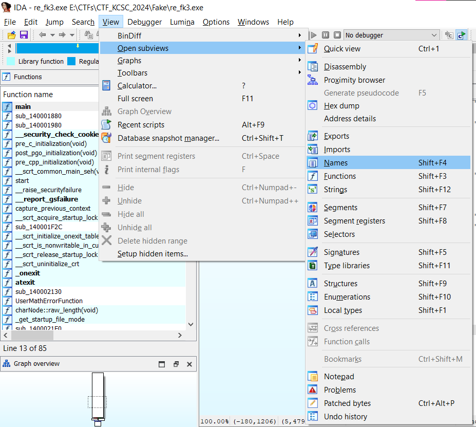
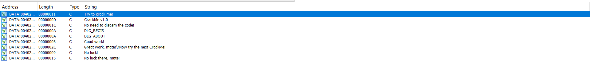
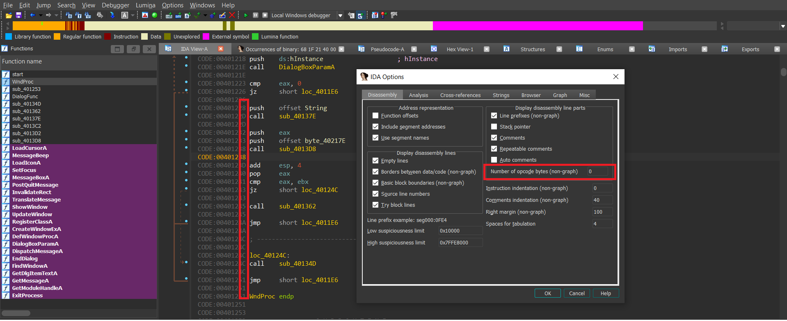
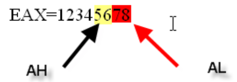

# IDA (THAM KHẢO KIENNOWAR)

## `Shift + F4` Cửa sổ Name.

- `Shift + F4` (`Name`): Hiện các Strings, các hàm, tất cả các References. 

    

- Trong `Name` nó sẽ đánh dấu các `string` mà nó tìm được bằng chữ cái `A` (gõ `a` để tìm nhưng may trong TH này a là kí tự đầu tiên bắt đầu như aS, aCorrect, ... nhưng nếu không may chương trình bắt đầu kiểu khác thì ta cứ tìm những dòng có `A` ở ngoài cùng "`A` aS" chả hạn).

    

- Ta sẽ nhấn thử vào string aCorrect để xem (bởi vì nó khá giống flag) thì nó sẽ nhảy đến đoạn sau:

    

- Ta thấy string này ở trong section `.rdata` của chương trình. 

## `Ctrl + X`


## `Comment` trong IDA.

- Nhấn vào chỗ comment trong dòng lệnh rùi chọn `Enter comment` (hay `:`).

    

## `Rename` (N) tronng IDA.

- Có thể đổi tên hàm, biến trong IDA. Click vào chỗ cần đổi gõ `N` hoặc chuột phải `Reaname`

    

- Nó sẽ hiện ra như sau:

    

## `Alt + M` và `Ctrl + M`: Mark Position

- Mục đích của `Bookmark` là để khi chúng ta đi quá xa đoạn code mà chúng ta đang làm việc thi việc cuộn chuột để tìm kiếm dẫn đến mất thơi gian, chi bằng ta đánh dấu nó lại thì khi đó có đi đâu chăng nữa bạn vẫn biết được chỗ để mà quay về.

- Để đánh dấu một `Bookmark` các bạn làm như sau,
chuột phải tại ví trí cần đánh dấu và chọn.

    

- Một hộp thoại xuất hiện, ta đặt tên cho Bookmark giả sử tôi đặt như sau :

    

- Bây giờ nếu không may ta có đi quá xa nơi mà chúng ta đã đánh dấu từ trước thì chỉ cần `Ctrl + M` hoặc như sau:

    

- Ngay lập tức ta sẽ nhận được một danh sách các BookMark, việc còn lại là tùy vào bạn muốn về
Bookmark nào:

    

    ```
    Nam nhi sống chấp nhận đôi lần bại danh
    Ngại ngần chi ngã đôi lần lại đứng lên
    ```

# [BÀI 1](https://kienmanowar.wordpress.com/2019/02/21/reversing-with-ida-from-scratch-p1/#more-3437)


## `View -> Open Subview`

## `Shift + F4`: Name.


## `Shift + F3`: Fuction.


## `Shift + F12`: String.



## `Disassembly`: mở một disassembly thứ 2, qua đó có thể truy xuất tới các hàm khác với cửa sổ đầu tiên và như vậy ta có thể phân tích được nhiều hàm tại cùng một thời điểm.


## `Hex dump`: một cửa sổ hiển thị dạng hexadecimal.


## `Imports`: cũng từ Open Subview, ta có thể truy xuất thông tin về các hàm được chương trình import thông qua Imports tab như hình dưới đây:


## Ngoài ra ta còn có `graph overview` (trong View -> Graph Overview). 


- Thanh điều hướng (navigator) phía trên hiển thị các phần khác nhau của một file đang phân tích bằng các màu khác nhau.


- Ngay bên dưới là các thông tin mô tả cho chúng ta biết mỗi màu có ý nghĩa gì, ví dụ màu xám là `.data section` và nếu bạn nhấp vào phần màu xám đó, IDA sẽ chuyển tới section có địa chỉ màu xám. Trong hình trên, chúng ta thấy có màu hồng tương ứng với external symbol hay `.idata section` và màu xanh tương ứng với các hàm được phát hiện tại code section.

# [BÀI 2: CHỨC NĂNG TÌM KIẾM TRONG IDA](https://kienmanowar.wordpress.com/2019/02/25/reversing-with-ida-from-scratch-p2/#more-3471)


## `Chỉnh màu`


- Nhìn màu tối cho đỡ hại mắt, còn màu trắng cứ chói chói nhìn nhiều mỏi mắt .

## `Alt + C`: Next Code.

- Tùy chọn này sẽ tìm kiếm lệnh kế tiếp đã được hiểu là `Code`. Nếu như không được nhận diện là `Code`, nó sẽ bỏ qua.

    

## `Ctrl + D`: Next Data.

- Tùy chọn này sẽ tìm kiếm các địa chỉ tiếp theo, nơi được IDA hiểu là `Data` (đã được định nghĩa) hoặc là xử lý dữ liệu tại bất kỳ section nào.

    

- Như trong trường hợp trên, IDA phát hiện một `dword` (`dd`) tại địa chỉ không tương ứng với bất kỳ lệnh nào, rõ ràng là, nếu chúng ta tiếp tục tìm kiếm, nó sẽ tìm kiếm dữ liệu tiếp theo. Ví dụ, quan sát phần dữ liệu bên dưới khi tôi thực hiện tìm kiếm một lần nữa.

- IDA dừng ở địa chỉ `00402004`, tại đó thông tin ở bên phải hàm ý rằng đó là nơi mà bạn sẽ làm việc với dữ liệu, thuộc `section DATA`. `IDA` sẽ bỏ qua các địa chỉ chỉ chứa số `0`, không có bất kỳ tham chiếu nào. Tóm lại, `IDA` chỉ tìm kiếm những dữ liệu mà chương trình có thể sử dụng tới.

## `Ctrl + A`: Next Explored và `Ctrl + U`: Next Unexplored.

- Tính năng đầu tiên sẽ tìm code hoặc data đã được định nghĩa (lệnh hoặc dữ liệu) và tính năng thứ hai áp dụng với các vùng không được phát hiện là lệnh hoặc dữ liệu hợp lệ.

- Ảnh `Ctrl + A`: Explored

    

- Ảnh `Ctrl + U`: Unexplored

    

## `Alt + I`: Search Immediate Value – `Ctrl + I`: Search Next Immediate Value

- Lệnh này tìm kiếm lệnh đầu tiên hoặc byte dữ liệu có chứa giá trị hằng số được chỉ định. Quá trình tìm kiếm tương đối chậm (nhưng nhanh hơn nhiều so với tìm kiếm text):

    

- Nếu chọn `Find all occurrences`, IDA sẽ tìm tất cả. Còn nếu không chọn, IDA sẽ tìm kiếm từng lần một, với trường hợp này, để lặp lại việc tìm kiếm, ta sẽ sử dụng `Search next immediate value`.

    

## `Alt + T`: Search Text – `Ctrl + T`: Search Next Text

- Tìm kiếm các chuỗi mà chúng ta nhập vào, bao gồm cả biểu thức chính quy nếu chúng ta muốn.

    

    

## `Alt + B`: Search Sequence Of Bytes - `Ctrl + B`: Next Search Sequence Of Bytes

- Tùy chọn này cho phép ta tìm kiếm các chuỗi các bytes ở hệ thập lục phân:

- Trước hết ta vào như hướng dẫn:

    

    

- Nếu ta để giá trị `Number of opcode bytes` = 0 thì nó sẽ hiện như trên, nếu ta thay bằng 10 thì nó sẽ hiện như sau.

    

- Quay lại chủ để chính thì tùy chọn này cho phép ta tìm kiếm các chuỗi các bytes ở hệ thập lục phân.

    

    

- Khi click vào ta sẽ được hình như sau:

    

## Search Not Function

- Chức năng này cho phép tìm kiếm byte đầu tiên không thuộc về bất kỳ hàm nào:

    

- Trên hình, ta thấy có một lệnh RET đứng độc lập, như vậy nó không thuộc bất kỳ một hàm nào. Đôi khi có những hàm mà IDA không thể xác định đó là hàm nhưng chúng lại có các lệnh hợp lệ.

# [BÀI 3: THANH GHI, LỆNH MOV](https://kienmanowar.wordpress.com/2019/02/28reversing-with-ida-from-scratch-p3/#more-3508)

## IDA Loader

- Các bạn đã thấy rằng khi mở một file thực thi trong `IDA`, nó sẽ sử dụng bộ phân tích tĩnh để phân tích file hay còn được gọi là `Loader`. Ở chế độ `Loader` này, chương trình sẽ không được thực thi, nhưng nó được `IDA` phân tích và sau cùng sẽ tạo ra một file `.idb` – là cơ sở dữ liệu lưu các thông tin trong quá trình phân tích, bao gồm đổi tên biến, tên hàm, các chú thích…. Trên thực tế, file `.idb` sẽ là tổng hợp của 5 files(`.id0`, `.id1`, `.nam`, `.id2`, and `.til`) được sinh ra trong quá trình phân tích:

    

- Khi bạn thực hiện lưu lại thì file thì IDA sẽ thực hiện xoá hết các file ở trên và chỉ lưu lại một file `.idb`.

    

    

- ***Bên lề***: `IDA` không có tính năng `Undo` như các bạn hay làm việc với các trình soạn thảo văn bản, cho nên bất kì những thay đổi nào mà bạn thực hiện trong quá trình phân tích sẽ không quay lại được và sẽ lưu thẳng vào `database`. Tuy nhiên, những thay đổi này chỉ là ở phía `database` mà thôi, nó sẽ không tác động trực tiếp lên `binary` gốc mà bạn đang phân tích.

- Ở chế độ Loader, chúng ta có thể phân tích bất kỳ hàm nào của chương trình, tuy nhiên không phải lúc nào chúng ta cũng có thể truy xuất vào hàm mà ta cần tìm hiểu, lúc đó ta phải học cách để debug. Tất nhiên, để tìm hiểu cách phân tích các hàm, chúng ta cần phải trang bị kiến thức cơ bản về các thanh ghi và các câu lệnh asm cơ bản

## Các thanh ghi là gì và chúng được sử dụng cho những mục đích nào?

- Khi `CPU` thực thi một lệnh, nó phải lấy lệnh từ bộ nhớ, giải mã lệnh, và sau đó thực hiện hành động tương ứng với mục đích của lệnh. Các hành động mà `CPU` thực hiện có thể thao tác thông tin trong các thanh ghi hoặc trong bộ nhớ.

- Khi tìm hiểu về các lệnh ASM, các bạn sẽ biết được nội dung của hai vị trí bộ nhớ không thể cộng trực tiếp với nhau. Bộ vi xử lý sẽ phải `chuyển` một trong số chúng vào `thanh ghi` và sau đó cộng nó với vị trí bộ nhớ còn lại.

- Trong kiến trúc `32 bit` các thanh ghi được sử dụng là `EAX`, `ECX`, `EDX`, `EBX`, `ESP`, `EBP`, `ESI`, `EDI` và `EIP`. Vào cuối bài, sẽ có một phần nhỏ dành cho `64 bit`.

    |32 bits|Lower 16 bits|Lower 8 bits|Upper 8 bits|
    |--|--|--|--|
    |EAX|AX|AL|AH|
    |EBX|BX|BL|BH|
    |ECX|CX|CL|CH|
    |EDX|DX|DL|DH|
    |ESI|SI|||
    |EDI|DI|||
    |EBP|BP|||
    |ESP|SP|||

## Các thanh ghi dùng chung?

- Chúng ta có 8 thanh ghi dùng chung, bao gồm:

    - `EAX` **thanh ghi chứa – accumulator**: được sử dụng nhiều nhất trong các lệnh <u>số học, logic, và chuyển dữ liệu</u>. Các thao tác nhân, chia sử dụng thanh ghi này. Với các hàm `API` của Windows, kết quả trả về của hàm thường sẽ lưu vào thanh ghi `EAX`.

    - `EBX` **thanh ghi cơ sở – base**: thanh ghi `EBX` thường được dùng để `định địa chỉ`, đặc biệt là khi làm việc với `mảng`. Thanh ghi này cũng được dùng như một thanh ghi dữ liệu khi không được sử dụng để định địa chỉ.

    - `ECX` **thanh ghi đếm – count**: `ECX` là một thanh ghi dùng chung có thể được sử dụng như là một `bộ đếm` cho các lệnh khác nhau. Nó cũng có thể chứa địa chỉ lệch của dữ liệu trong bộ nhớ. Các lệnh sử dụng `bộ đếm` là các lệnh liên quan lặp chuỗi, các lệnh chuyển, xoay và `LOOP/LOOPD`.

    - `EDX` **thanh ghi dữ liệu – data**: là một thanh ghi dùng chung dùng để chứa **một phần** kết quả của **phép nhân** hoặc một phần của **phép chia**. Nó cũng có thể truy cập địa chỉ dữ liệu trong bộ nhớ trực tiếp.

    - `EDI` **chỉ số đích – destination**: `EDI` thường được sử dụng trong các thao tác làm việc với `chuỗi hoặc mảng`. Thanh ghi này sẽ trỏ tới `chuỗi đích`. Bên cạnh đó nó cũng là một thanh ghi dùng chung.

    - `ESI` **chỉ số nguồn – source**: Giống như `EDI`, `ESI` cũng thường được sử dụng trong các thao tác làm việc với chuỗi hoặc mảng. Thanh ghi này sẽ trỏ tới chuỗi nguồn.

    - `EBP` **con trỏ cơ sở – base**: `EBP` trỏ tới vị trí bộ nhớ, bên cạnh mục đích dùng chung thì nó được sử dụng làm `frame pointer` để truy xuất các tham số và các biến cục bộ trong ngăn xếp của một hàm.

    - `ESP` **con trỏ ngăn xếp – stack**: thanh ghi này `luôn trỏ đến đỉnh hiện thời của Stack`. Theo nguyên tắc làm việc của `Stack` thì thanh ghi này sẽ hướng về phía địa chỉ thấp hơn.

- Như vậy, có tổng cộng 8 thanh ghi 32 bit dùng chung là `EAX`, `EBX`, `ECX`, `EDX`, `ESP`, `EBP`, `ESI` và `EDI`. Ngoài ra, các thanh ghi này còn có thể chia nhỏ thành các thanh ghi 16-bit và 8-bit như hình dưới đây:

    

- Ví dụ: Ví dụ, nếu thanh ghi `EAX` có giá trị là `0x12345678` thì `AX` là thanh ghi 16 bit chứa bốn chữ số cuối cùng:  

    

- Thanh ghi `AX` có thể được tách thành 2 thanh ghi 8 bit, đó là cặp thanh ghi: `AH` chứa hai số 5 và 6 và `AL` chứa hai số cuối cùng là 7 và 8:

    

- Như vậy các bạn có thể hình dung, thanh ghi 32 bit `EAX` được tách thành một thanh ghi `16` bit gọi là `AX`; `AX` được tách thành hai thanh ghi `8` bit được gọi là `AH` và `AL`. Tương tự đối với các thanh ghi `EBX` (`BX`, `BH` và `BL`), `ECX` (`CX`, `CH` và `CL`) và `EDX` (`DX`, `DH` và `DL`), riêng các thanh ghi còn lại chỉ được tách thành một thanh ghi `16` bit, không chia nhỏ thêm thành các thanh ghi `8` bit:

    

## Các thanh ghi đặc biệt.

- `EIP` **con trỏ lệnh – instruction**: đây là một thanh ghi đặc biệt, nó luôn trỏ đến lệnh tiếp theo sẽ được thực hiện. Khác với các thanh ghi khác, `EIP` không thể bị tác động trực tiếp bởi các lệnh.

- Một thanh ghi quan trọng khác là `EFLAGS` (thanh ghi cờ), mỗi bit của nó được dùng để phản ánh một trạng thái nhất định của phép toán. Dựa theo kết quả tính toán mà các cờ sẽ được bật và căn cứ trên các cờ này để thực hiện rẽ nhánh thực thi của chương trình, chúng ta sẽ tìm hiểu thêm sau.

    

    Bên lề: Zero Flag (ZF) là cờ phổ biến nhất được sử dụng trong reversing. Chủ yếu được sử dụng trong các lệnh rẽ nhánh có điều kiện, làm thay đổi luồng thực thi dựa trên các kết quả lệnh trước đó.

- Tiếp theo là các thanh ghi đoạn, các thanh ghi này trỏ tới các phần khác nhau của file thực thi như `CS = CODE`, `DS = DATA` v..v…

    

- Trong quá trình làm việc với thanh ghi và bộ nhớ thì có một chi tiết quan trọng khác là kích thước của các kiểu dữ liệu thường được sử dụng nhiều nhất:

    

- `IDA` hỗ trợ xử lý nhiều loại dữ liệu mà chúng ta sẽ thấy qua từng phần một. Điều quan trọng là phải ghi nhớ rằng `BYTE` là `1 byte`, `WORD` là `2 bytes` và `DWORD` `4 bytes` trong bộ nhớ.

## Các lệnh ASM cơ bản: Lệnh `mov`


- `MOV dest, src`: Sao chép nội dung của toán hạng nguồn (`src`) tới đích (`dest`). Thao tác: `dest <- src`. Lệnh này được sử dụng để chuyển dữ liệu giữa các thanh ghi, giữa một thanh ghi và một ô nhớ hoặc chuyển trực tiếp một số vào một thanh ghi hay ô nhớ. Hiểu cơ bản thì lệnh mov này có thể tương ứng với lệnh gán ở ngôn ngữ bậc cao.

- **Ví dụ 1:** Câu lệnh như sau: `MOV EAX, EDI`; `EAX` nhận giá trị của `EDI`; còn `EDI` giữ nguyên giá trị, không bị thay đổi.

    

    Nói chung, chỉ có thể chuyển trực tiếp dữ liệu từ hoặc đến thanh ghi, ngoại trừ thanh ghi `EIP` **không thể** là Destination hoặc Source của bất kỳ hoạt động nào. Chúng ta không thể thực hiện câu lệnh sau:

    ```asm
    MOV EIP, EAX; Câu lệnh hày hoàn toàn không hợp lệ.
    ```

- **Ví dụ 2:** `MOV EAX, 1`; chuyển số `1` vào thanh ghi `EAX`, giá trị trước đó của thanh ghi `EAX` bị ghi đè lên (thay bằng giá trị mới).

    

- **Ví dụ 3**:

    

    Ở ví dụ trên, thanh ghi `EAX` lúc này sẽ nhận giá trị là một địa chỉ bộ nhớ. Tiền tố `offset` ở phía trước chỉ ra rằng phải **lấy địa chỉ** chứ không phải nội dung của ô nhớ đó. Vì vậy, nếu tôi nhấn `Q`, `IDA` sẽ chuyển đối câu lệnh này thành dạng:

    

    `MOV EAX, 46f038h`; lệnh này không cung cấp cho ta bất kỳ thông tin gì về nội dung của địa chỉ đó. Nếu nhấp chuột phải vào địa chỉ `46f038`, ta có thể quay về lệnh gốc ban đầu mà `IDA` đã hiển thị:

    

    Có một câu hỏi đặt ra: Liệu `IDA` có thể cho tôi biết về các thông tin bổ sung liên quan tới địa chỉ bộ nhớ đó không?

    Nếu tôi chuyển qua cửa sổ `Hex View` và tìm địa chỉ trên bằng cách nhấn phím tắt `G` và nhập vào địa chỉ cần đến:

    Ta thấy rằng, tại địa chỉ này đang lưu các `bytes` có giá trị `0x00`. Theo mô tả địa chỉ trong IDA, tôi biết đó là một `DWORD`:

    Nếu trở lại màn hình disassembly và nhấp đúp vào địa chỉ này, ta sẽ tới đây:

    

    

    Tiền tố `dword` đứng đằng trước một địa chỉ, có nghĩa là nội dung của địa chỉ đó là một `DWORD`, sau đó có kiểu dữ liệu `dd` tương ứng với `DWORD` và tiếp theo là giá trị `0` lưu tại vị trí ô nhớ đó. Như vậy, `IDA` đang nói với tôi rằng chương trình sử dụng địa chỉ đó để lưu `DWORD` và hơn thế nữa, ở bên phải tôi thấy các tham chiếu đến vùng code mà `DWORD` này sẽ được sử dụng.

    

    Như trên hình, ta thấy có hai chỗ tham chiếu. Mỗi mũi tên là một vị trí và khi đặt con trỏ chuột tại đó ta có thể xem trước được mã lệnh tại từng vị trí này.

    

    Nếu tôi nhấn phím X trên đầu của địa chỉ, IDA sẽ hiển thị cho ta thấy các lệnh sử dụng tới địa chỉ đó:

    

    

    Lệnh đầu tiên trong hình sẽ thực hiện đọc địa chỉ mà chúng ta đã thấy ở trên và lưu vào thanh ghi `eax`. Câu lệnh thứ hai sẽ ghi một `DWORD` (phụ thuộc vào giá trị của `eax`) vào nội dung bộ nhớ tại địa chỉ `0x46F038`.

- **Ví dụ 4:** Chuyển nội dung hoặc giá trị tại địa chỉ đó vào thanh ghi EAX, tức là EAX = 0x0

    

    Ngoài ra thỉnh thoảng câu lệnh trên sẽ là: `mov eax, dword ptr ds:[46f908]` thì mình tự hiểu là sẽ đưa giá trị (`dword`) của địa chỉ `46f908` vào thanh eax.

- **Ví dụ 5:** 

    

    Lệnh trong hình sử dụng dấu ngoặc `[]` vì rõ ràng bạn không biết giá trị tĩnh mà thanh ghi có thể có được tại thời điểm đó và bạn không thể biết hướng nào bạn sẽ trỏ đến để lấy thêm thông tin từ đó. Tất nhiên trong trường hợp này, ví dụ nếu thanh ghi `EDI` trỏ tới `0x10000`, lệnh này sẽ tìm nội dung trong địa chỉ bộ nhớ đó và sao chép nó vào thanh ghi `ECX`.

- **Ví dụ 6:**

    

    Trong hình trên, chúng ta thấy rằng EAX sẽ nhận giá trị 0x45ba14 vì nó có tiền tố offset ở phía trước. Và nó cho ta biết rằng `IDA` không thể nhận biết được kiểu dữ liệu là gì nên có thêm tiền tố `unk` (`unknown`).

- **Ví dụ 6:**

    

    Nhấn `G` nhảy đến địa chỉ `4280e0` ta được lệnh mov như sau, thấy cái tên hồng hồng ở đằng sau trông khá là ghê gớm, ta thực hiện đổi lại

    

    

    Lúc này ta sẽ thấy như sau:

    

    Nếu tôi nhấp đúp vào tên dài loằng ngoằng như trong hình, IDA sẽ dẫn tới đây:

    

    Ta thấy khi cuộn chuột lên trên thì xuất hiện này càng nhiều các dòng màu hồng.

    

    Như đã biết, bảng `IAT` là bảng lưu thông tin địa chỉ của các hàm được import khi thực thi file, hầu như luôn luôn nằm tại section `.idata` hoặc `.rdata`. Nếu tôi quan sát địa chỉ đó tại màn hình `Hex View`, nó vẫn chưa có giá trị của hàm bởi vì `IAT` chỉ được điền đầy đủ khi thực thi chương trình, còn hiện tại thì vẫn chưa.

    

    Để biết hàm này được lấy từ thư viện nào ta cuộn chuột lên trên một chút, kết quả là các hàm được `import` từ thư viện `QtCoreX.dll` và ở trên còn có nhiều dlls khác nữa (lăn chuột lên khá là lâu đó, đang từ địa chỉ `00430820` lăn lên đến địa chỉ `004304C4` thì mới thấy).

    

## 64 bits

- kiến trúc `x64` được thiết kế như một phần mở rộng cho `x86` và có sự tương đồng mạnh mẽ với các tập lệnh `x86`. Có một vài sự khác biệt từ góc độ phân tích mã lệnh:

- Các thanh ghi dùng chung `32` bit (4 byte) `eax`, `ebx`, `ecx`, `edx`, `esi`, `edi`, `ebp` và `esp` được mở rộng thành `64` bit (8 byte); các thanh ghi này được đặt tên là `rax`, `rbx`, `rcx`, `rdx`, `rsi`, `rdi`, `rbp` và `rsp`.

- `8` thanh ghi mới được bổ sung thêm là `r8`, `r9`, `r10`, `r11`, `r12`, `r13`, `r14`, và `r15`.

- Một chương trình có thể truy cập vào thanh ghi dưới dạng `64` bit (`rax`, `rbx`, v.v.), `32` bit (`eax`, `ebx`, v.v.), `16` bit (`ax`, `bx`, v.v.) hoặc `8` bit (`al`, `bl`, …).

- Truy cập các thanh ghi `r8 – r15` dưới dạng `byte`, `word`, `dword` hoặc `qword` bằng cách bổ sung thêm `b`, `w`, `d` hoặc `q` vào sau tên thanh ghi.

- Trong kiến trúc `x86`, các tham số của hàm sẽ được đẩy vào ngăn xếp trước khi gọi hàm, trong khi ở kiến trúc `x64`, bốn tham số đầu tiên được truyền vào các thanh ghi `rcx`, `rdx`, `r8` và `r9` và nếu chương trình còn các tham số khác nữa, chúng sẽ được lưu vào stack. Điều này sẽ khiến cho khó xác định được xem địa chỉ bộ nhớ nào là biến cục bộ hay tham số của hàm.

    |64 bits|32 bits|Lower 16 bits|Lower 8 bits|Upper 8 bits|
    |--|--|--|--|--|
    |RAX|EAX|AX|AL|AH|
    |RBX|EBX|BX|BL|BH|
    |RCX|ECX|CX|CL|CH|
    |RDX|EDX|DX|DL|DH|
    |RSI|ESI|SI|||
    |RDI|EDI|DI|||
    |RBP|EBP|BP|||
    |RSP|ESP|SP|||
    |R8 - R15|R8D|R8W|R8B|
