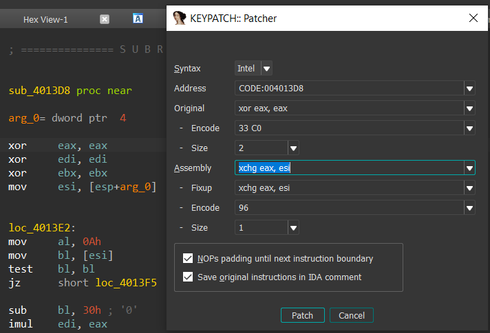
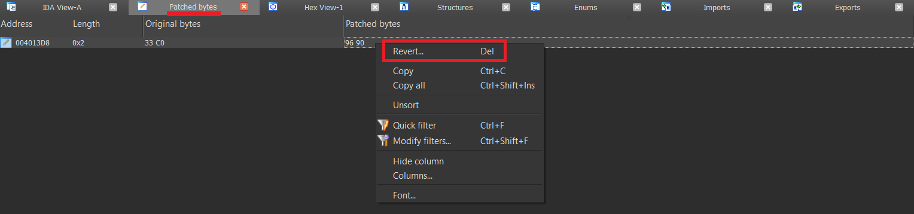
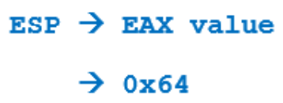
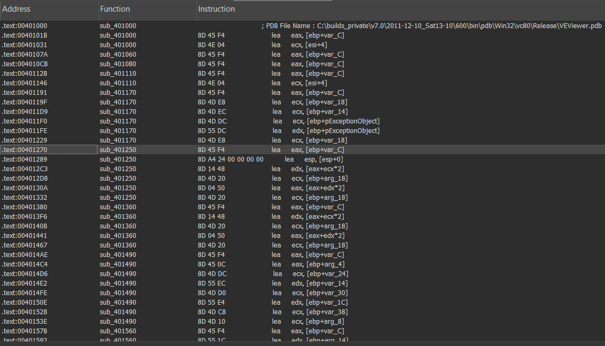

# [BÀI 4: LỆNH XCHG VÀ CÁC CÂU LỆNH TƯƠNG TÁC VỚI STACK](https://kienmanowar.wordpress.com/2019/03/04/reversing-with-ida-from-scratch-p4/#more-3551)

## Lệnh xchg

- `XCHG A, B`; Hoán đổi giá trị của `A` với giá trị của `B`. `A` và `B` có thể **là hai thanh ghi**, **thanh ghi và ô nhớ**, nhưng `không` được phép **đồng thời là 2 ô nhớ**.

    ```ASM
    xchg eax, ebx
    xchg eax, [ebx]
    xchg [ebx], eax
    ; câu lệnh sau là không được
    ; xchg [eax], [ebx]
    ```

- Mở lại file [crackme](_FILE/CRACKME.EXE), chuyển đến địa chỉ `4013d8`, ta được như sau:

    

- Trước hết cài `keypatch` cho `IDA`, hướng dẫn làm y hệt trong file readme của các đàn anh đi trước.

    - `Keypatch` (một plugin được viết bởi hai anh *Nguyen Anh Quynh* (aka aquynh) & *Thanh Nguyen* (aka rd) đã giành được giải thưởng plugin contest của Hexrays năm 2016 – [news](https://www.hex-rays.com/contests/2016/index.shtml))

    - Để cài đặt và sử dụng plugin này các bạn xem [tại đây](https://github.com/keystone-engine/keypatch).

- Quay lại với ví dụ trên sau khi ta nhảy đến địa chỉ đó ta thực hiện thay đổi câu lệnh bằng patching mà ta vừa mới cài xong. Các bạn chỉ cần nhấn vô dòng đó, chuột phải -> Keypatch -> Patcher (hoặc `Ctrl + Alt + K`).

    

- Khi đó cửa số sau sẽ xuất hiện:

    

- Ta thực hiện thay đổi như trên hình:

    

- Sau khi xong ta thấy chương trình có xuất hiện thêm dòng nop và bên cạnh có chú thích rất là chi tiết cho sự thay đổi ở trên:

    

- Khi ta chuyển về đồ hoạ (spacebar) thì vẫn sẽ clean như sau:

    

- Quay lại với lệnh `XCHG`, giả sử nếu `EAX` có giá trị `0x12345678` và `ESI` có giá trị `0x55`, khi ta thực hiện lệnh `XCHG` thì thanh ghi `EAX` sẽ được gán giá trị `0x55` và thanh ghi `ESI` là `0x12345678`. Như vậy, sau khi thực hiện lệnh `XCHG` thì giá trị của hai thanh ghi được hoán đổi cho nhau.

- **Bên lề:** Quan sát trong menu `View > Open subviews`, bạn sẽ thấy có một lựa chọn là **Patched Bytes** (`Ctrl+Alt+P`). Cửa sổ này cho ta biết địa chỉ nào có lệnh đã bị thay đổi và có thể khôi phục lại được các giá trị bau đầu thông qua lựa chọn `Revert`:

    

    

    Trở về nguyên bản ban đầu:

    

- Lệnh `XCHG` cũng có thể được sử dụng để hoán đổi giữa giá trị thanh ghi với nội dung bộ nhớ được trỏ bởi thanh ghi:

    

    Trong ví dụ trên, [ESI] có nghĩa là tìm kiếm nội dung tại vị trí trong bộ nhớ được trỏ bởi giá trị của thanh ghi `ESI` và hoán đổi cho giá trị của EAX. Giá trị của thanh ghi `EAX` sẽ được lưu vào vị trí bộ nhớ mà thanh ghi `ESI` trỏ tới nếu như vùng nhớ đó có quyền ghi.

    Giả sử, nếu `EAX` có giá trị `0x55` và `ESI` có giá trị `0x10000`. Lệnh `XCHG` lúc này sẽ kiểm tra hiện đang có gì lưu tại vị trí bộ nhớ `0x10000` và vùng nhớ này có thể ghi được không, nó sẽ lưu giá trị `0x55` ở đó và sẽ đọc giá trị mà nó đã có và lưu vào thanh ghi `EAX`.

- Điều gì xảy ra nếu chúng ta thực hiện tương tự, nhưng thay vì sử dụng thanh ghi chúng ta sử dụng một địa chỉ bộ nhớ là một giá trị số cụ thể như chúng ta đã thực hiện với lệnh `MOV` ở phần trước?

    

    Kết quả:

    

    Cũng giống như với lệnh `MOV`, khi xuất hiện tiền tố `dword_` mà không phải là `offset_` ở phía trước, nó có nghĩa là nó hoán đổi **nội dung** của `0x4020DC` với giá trị của `EAX`.

## Các câu lệnh tương tác với Stack

### Stack là gì?

- `Stack` (Ngăn xếp) là một phần của bộ nhớ và là cấu trúc dữ liệu một chiều (các phần tử được cất vào và lấy ra từ cùng một đầu của cấu trúc). Việc truy cập vào stack sẽ tuân theo cơ chế `FILO`, nghĩa là **“Vào trước, ra sau”** hay `LIFO`, **“Vào sau, ra trước”.** Các bạn có thể hình dung Stack như một chồng đĩa, chiếc đĩa cuối cùng được xếp vào sẽ nằm trên đỉnh và chỉ có nó mới có thể được lấy ra đầu tiên. **Theo quy ước, Stack hướng về phía địa chỉ bộ nhớ thấp hơn**.

    

- `Stack` cho phép l**ưu trữ** và **khôi phụ**c lại dữ liệu. Đối với việc xử lý dữ liệu trên stack, có hai thao tác lệnh cơ bản: `PUSH`, *đẩy/lưu một phần tử vào đỉnh ngăn xếp* và thao tác ngược lại của nó `POP`, *loại bỏ/khôi phục một phần từ được đẩy vào cuối cùng ra khỏi ngăn xếp*.

- Tại mỗi thời điểm, ta **chỉ** có quyền truy cập tới **đỉnh** của stack, nghĩa là, phần tử được đẩy vào cuối cùng. Thao tác ``POP`` cho phép lấy được phần tử này ra khỏi ngăn xếp và cho phép truy cập tới phần tử tiếp theo bên dưới (phần tử được đẩy vào trước đó) – trở thành phần tử được xếp vào cuối cùng. Trong [crackme.exe](_FILE\CRACKME.EXE), chúng ta sẽ lấy ví dụ về cả hai lệnh `PUSH` và `POP`.

### Lệnh PUSH


- Lệnh này được dùng để thêm/ lưu dữ liệu vào trong ngăn xếp. Toán hạng nguồn có thể là các **thanh ghi dùng chung** hoặc **ô nhớ**. Sau mỗi lần thực hiện lệnh Push thì giá trị của thanh ghi `ESP` sẽ được giảm đi.

    

- Thông thường, trong kiến trúc 32 bit, lệnh `PUSH` thường được sử dụng để truyền các tham số của một hàm vào ngăn xếp trước khi thực hiện lời gọi hàm bằng một lệnh `CALL`.

- Quan sát ví dụ tại địa chỉ `0x40104f` trong hình minh họa ở trên. Lệnh `PUSH 64` đặt giá trị dword 0x64 vào đỉnh của stack, sau đó lệnh tiếp theo `PUSH EAX` đặt giá trị EAX lên trên giá trị dword 64 đã lưu trước đó. Như vậy, lúc này giá trị của EAX sẽ nằm tại đỉnh của ngăn xếp:

    

- Cũng trong hình trên, ta còn thấy một kiểu lệnh PUSH khác. Thay vì lưu các giá trị hằng số thì lưu các địa chỉ bộ nhớ vào Stack, như trong trường hợp sau:

    

- Ở đây có tiền tố `offset` ở phía trước của TAG tương ứng với một chuỗi, như vậy có nghĩa là sẽ push một địa chỉ có nội dung là một chuỗi hay mảng ký tự vào đỉnh của Stack. Chúng ta nhấp đúp vào thẻ đại diện cho tên chuỗi là WindowName. Click vào 2 tên đó ta được như sau:

    

- Bên dưới `0x4020e7`, địa chỉ tiếp theo sẽ là `0x4020f4`, ở giữa hai địa chỉ này sẽ là một loạt các **bytes** liên tiếp tương ứng với các kí tự của chuỗi “Crackme v1.0” và phân định bởi số 0 ở cuối, biểu diễn cho việc kết thúc một chuỗi (hay còn gọi là `null byte`).

    

- Nếu chúng ta nhấn phím `D` để thay đổi kiểu dữ liệu trên WindowName, bằng cách này ta sẽ ép IDA chuyển đổi thành các bytes (db) thay vì để cho IDA tự động nhận biết đó là một mảng các ký tự:

    

- Tại vị trí tham chiếu tới chuỗi, câu lệnh gốc lúc này sẽ bị thay đổi. Tiền tố `offset` ở phía trước có nghĩa là sẽ đẩy giá trị `0x4020E7`, nhưng giờ đây nội dung không còn là một mảng các ký tự nữa mà là một `byte`, lệnh lúc này đã được thay đổi thành:

    

    `push offset byte_4020E7`, lúc trước là lệnh `push offset aCrackmeV10`.

    Bởi vì khi IDA tìm kiếm nội dung của `0x4020e7` để thông báo cho chúng ta giá trị đó là gì, do tại đó đã được chuyển thành một db, điều này có nghĩa là biến lúc này đã bị đổi thành một byte duy nhất do thao tác ta đã thực hiện ở trên.

    

- Để lấy lại chuỗi ban đầu, ta nhấn phím `A`, IDA sẽ tự động chuyển đổi lại thành chuỗi ASCII:

    

- Tương tự như vậy, khi trong quá trình phân tích nế ta phát hiện bất kì chuỗi nào được biểu diễn dưới dạng các byte rời rạc như hình dưới đây:

    

    Hãy chuyển tới vị trí **bắt đầu** và nhấn `A`, nó sẽ được chuyển thành chuỗi tương ứng:

    

    

    Trong trường hợp này, ta thấy chuỗi này không được định nghĩa bằng **hai dòng** giống như chuỗi trước đó và cũng không cho biết nó là một `CHAR []`, tuy nhiên nó lại được định nghĩa bằng một thẻ bắt đầu bằng **sz** hoặc a** (trên máy của bạn, máy của tui là chữ **a**) vì nó là một chuỗi `ASCII`.

- Ở ví dụ trước, `IDA` cung cấp thông tin bổ xung rõ hơn bởi nó nhận diện được đó là một tham số của hàm API và thông báo rằng tham số này phải là một `char[]`. Đó là lý do tại sao `IDA` cũng cấp thêm thông tin bổ sung như vậy, còn đối với một chuỗi bình thường sẽ giống như các bạn thấy ở trên.

- Ở đây chúng ta thấy một chuỗi khác:

    

- Tại địa chỉ `0x402110`, ta có thể phân tách nó thành các bytes bằng cách nhấn phím tắt `D` tại **aMenu**:

    

    Nếu nhấn `A`, ta sẽ có lại chuỗi ban đầu. Nhấn `X` để tìm các tham chiếu tới chuỗi này, kết quả sẽ tìm được nơi mà chuỗi này được sử dụng:

    

    

- Chúng ta thấy rằng lệnh Mov sẽ lấy địa chỉ `0x402110` vì có tiền tố `offset` ở phía trước. Thông thường, khi truyền các tham số cho một hàm, chúng ta sẽ luôn thấy lệnh có dạng `PUSH offset xxxxx,` bởi vì cái ta cần là truyền địa chỉ nơi mà là chuỗi, còn nếu như không có tiền tố `offset` mà thay vào đó là `dword` thì sẽ đẩy nội dung của địa chỉ `0x402110` là các bytes `55 4e 45 4d` (của cùng một chuỗi). Nhưng các hàm `APIs` lại không hoạt động theo cách này, chúng luôn nhận con trỏ hoặc địa chỉ bắt đầu hoặc nơi mà chuỗi bắt đầu.

- Trong câu lệnh bên trên, tiền tố `DS: TAG` chỉ ra rằng nó sẽ lưu vào một địa chỉ bộ nhớ của đoạn dữ liệu (`DS = DATA`). Khi làm việc với **struct**, chúng ta sẽ tìm hiểu về trường hợp đó. Bây giờ, vấn đề quan trọng là nó lưu địa chỉ trỏ đến đầu chuỗi vào `section DATA`.

    

### Lệnh POP


- Lệnh này được dùng để lấy ra giá trị từ đỉnh của ngăn xếp, sau khi thực hiện lệnh thì giá trị của thanh ghi `ESP` sẽ được tăng lên để trỏ tới phần tử tiếp theo.

    

- Ở ví dụ trên hình, lệnh `POP` thực hiện thao tác đọc giá trị trên đỉnh của ngăn xếp và chuyển nó đến thanh ghi đích, trong trường hợp này, câu lệnh `POP EDI` sẽ đọc giá trị đầu tiên hay giá trị trên đỉnh của ngăn xếp và sao chép nó vào thanh ghi `EDI`, sau đó trỏ thanh ghi `ESP` vào giá trị bên dưới và giá trị mới này sẽ trở thành đỉnh của ngăn xếp.

- Thử tìm kiếm các lệnh POP, chúng ta thấy rằng không có nhiều biến thể của lệnh mặc dù có khả năng thực hiện POP giá trị vào một địa chỉ bộ nhớ thay vì một thanh ghi, nhưng tùy chọn này không được sử dụng rộng rãi.

    

# [BÀI 5: LỆNH `LEA`](https://kienmanowar.wordpress.com/2019/03/05/reversing-with-ida-from-scratch-p5/#more-3590)

- Cú pháp: `lea A, B`.

    Lệnh `LEA` (nạp địa chỉ hiệu dung vào thanh ghi) thực hiện chuyển một địa chỉ được chỉ định trong `B` (nguồn) vào `A` (đích). Nội dung của `B` không bao giờ được truy cập, nó sẽ **luôn là một địa chỉ** hoặc **là kết quả của phép tính toán** nằm trong dấu ngoặc vuông `[]` của toán hạng thứ hai. Lệnh `LEA` được sử dụng rất nhiều để lấy địa chỉ bộ nhớ của các biến hoặc các tham số.

- Quan sát một ví dụ dưới đây: [VEViewer.exe](_FILE\VEViewer.exe)

    

    Các bạn để ý, tại các hàm mà `IDA` phân tích ta sẽ thấy có các tham số được truyền vào cho hàm. Các tham số này được kí hiệu là `arg_x`. Thường thì việc truyền tham số cho một hàm sẽ thông qua lệnh `PUSH` trước khi thực thi hàm đó. Như chúng ta đã thấy trên hình, lệnh `PUSH` thực hiện lưu các giá trị vào trong ngăn xếp, các giá trị này được gọi là đối số hay tham số.

    

    Quan sát hình, ở phần đầu của mỗi hàm, ta sẽ thấy có một danh sách liệt kê gồm có các biến cục bộ và các tham số mà hàm sử dụng. Cụ thể, tại hàm `sub_4016C0` trên hình, ta thấy có một tham số trong ngăn xếp bởi hàm chỉ nhận 3 giá trị arg, trong trường hợp này IDA đặt tên là `arg_0`, `arg_4`, `arg_8`. Bên cạnh đó, hàm cũng dành riêng không gian trong ngăn xếp để phục vụ lưu các biến cục bộ, các biến cục bộ này nằm phía trên các tham số như quan sát trên hình và bắt đầu bằng `var_x`.

    Tôi sẽ giải thích sau về vị trí chính xác của các tham số và các biến trong `stack`. Còn tại thời điểm này bạn chỉ cần nhớ rằng **mỗi tham số hoặc biến mà một hàm sử dụng sẽ có một địa chỉ do hệ thống cấp phát và một giá trị được lưu tại địa chỉ đó.**

- Quay trở lại với lệnh `LEA`, chương trình sử dụng một lệnh `LEA` tại địa chỉ `0x4016DB` `lea eax, [ebp+var_C]`, câu lệnh này sẽ thực hiện **lấy địa chỉ của biến trên Stack** và **gán vào thanh ghi EAX.** Nếu ngược lại, đây là một câu lệnh `MOV` thì sẽ chuyển **nội dung** hoặc **giá trị** đang được lưu giữ trong biến vào EAX.

    

- Hay nói cách khác, lệnh `LEA`, mặc dù sử dụng cặp ngoặc `[]`, nhưng nó **chỉ chuyển địa chỉ** *đã được thực hiện tính toán* bên trong ngoặc **mà không truy cập vào nội dung của ô nhớ và thanh ghi EBP** (thanh ghi EBP thường được sử dụng làm thanh ghi cơ sở cho việc truy xuất các biến và các tham số trên stack của mỗi hàm). Về bản chất, quá trình thực hiện thực ra chỉ là **cộng** hoặc **trừ** thanh ghi `EBP` với một giá trị hằng số **để trỏ tới một địa chỉ nằm trên Stack** mà thôi, tuy nhiên do IDA là công cụ hỗ trợ khả năng tương tác cao, nên nó sẽ đánh nhãn cho từng biến để ta có thể dễ dàng đặt lại tên khi phân tích.

- Tại `IDA`, nếu ta nhấn phải chuột vào biến đó, ta sẽ thấy được cách biểu diễn toán học thuần túy là `[EBP-0Ch]` và ta có thể thay đổi lệnh bằng cách nhấn phím `Q`. Đó là lý do tại sao lệnh `LEA` chỉ thực hiện việc tính toán `EBP-0C`, vì đơn giản thanh ghi `EBP` đang lưu một địa chỉ trên ngăn xếp làm base (cơ sở) cho hàm, sau khi trừ đi giá trị `0C` ta có được địa chỉ của biến nói trên.

    

- Ở đây, nhiều người có thể tự hỏi sẽ dễ dàng hơn cho `IDA` nếu sử dụng ký hiệu toán học thuần túy cho các biến và các tham số thay vì sử dụng **[EBP – hoặc + một tag]**. Vấn đề là trong **reversing**, việc ta có thể `đổi tên` các biến và tham số với tên mà ta mường tượng ra khi tác giả code chương trình là rất quan trọng, như vậy sẽ giúp chúng ta dễ dàng hơn trong quá trình phân tích. Lúc đó, sẽ không còn là một biến được gọi là `EBP – 0C` mà có thể đổi thành `EBP + SIZE`, nếu lúc phân tích, tôi biết lệnh này sẽ lưu một `size` (Việc đổi tên được thực hiện bằng cách sử dụng phím tắt `N`). Nếu cần quay về câu lệnh gốc tôi có thể nhấn chuột phải lên nó để thay đổi.

    

- Xem xét các ví dụ:

    Ví dụ 1: `lea eax, [4+5]`

    Lệnh trên sẽ tính toán và gán `9` vào thanh ghi `EAX`, nó sẽ không chuyển nội dung của địa chỉ `0x9` như lệnh MOV sẽ thực hiện: **mov eax, [4+5]**

    Ví dụ 2: `lea eax, [ebp–0C]`

    Lệnh trên chuyển kết quả của `ebp–0C`, là địa chỉ bộ nhớ của biến thu được khi thực hiện phép tính `ebp–0C` và gán cho thanh ghi `eax`. Khác với lệnh này **mov eax, [ebp–0C]**, ngoài việc tính toán `ebp-0C` để có được kết quả địa chỉ giống như lệnh `lea`, lệnh này còn tìm kiếm nội dung của một giá trị được lưu trữ tại địa chỉ đã tính toán và gán giá trị đó cho `eax`.

- Chốt lại vấn đề, điều rất quan trọng giúp chúng ta nhận ra sự khác biệt giữa lệnh `LEA` và lệnh `MOV` là:

    Lệnh `LEA` thực hiện lấy địa chỉ biến. __Tương ứng mã giả là a = &b.__

    Lệnh `MOV` thực hiện lấy giá trị được lưu tại địa chỉ biến. __Tương ứng với mã giả là a = *b__.

- Khi phân tích ứng dụng Vewiever, chúng ta thấy trong kết quả của việc tìm kiếm lệnh `LEA` thì hầu như đều sử dụng lệnh này để có được địa chỉ của các biến hoặc tham số trên ngăn xếp. Có rất nhiều lệnh sử dụng `[EBP + something]`.

    

- Một ứng dụng khác của lệnh `LEA` là các phép toán kết hợp giữa các thanh ghi và các hằng số, kết quả tính được gán cho toán hạng đầu tiên có thể **một số** hoặc **một địa chỉ** phụ thuộc vào giá trị của các thanh ghi.

    

- Trong hình trên, tại thời điểm thực hiện tính toán, giá sử nếu `ESI` có giá trị `0x400000` và `EAX` bằng `2`, thì giá trị của thanh ghi `EDX` sẽ là kết quả tính toán của biểu thức `0x400000 + 2*4 + 0x14`:

    

    Nói cách khác, nó sẽ gán giá trị `0x40001c` vào thanh ghi `EDX`.

# [BÀI 6: LỆNH ADD, SUB, INC/DEC, IMUL, DIV/IDIV, AND/OR/XOR, NOT, NEG, SHL/SHR](https://kienmanowar.wordpress.com/2019/03/07/reversing-with-ida-from-scratch-p6/#more-3600)

## `ADD`

- Cú pháp: `add A, B` (A = A + B).

    Câu lệnh `add` thực hiện cộng giá trị của `B` với `A`, kết quả tính toán sẽ lưu vào `A`. Tức là `A = A + B`. `A` ở đây có thể là **một thanh ghi** hoặc là **nội dung của một ô nhớ**, `B` có thể là **một thanh ghi**, một **hằng số** hoặc **nội dung của một ô nhớ**. Tuy nhiên, trong câu lệnh `ADD` thì cả A và B **không thể đồng thời là nội dung của ô nhớ**.

- Quan sát một số ví dụ trong [VEViewer](_FILE\VEViewer.exe) bằng việc tìm kiếm chuỗi add.

    

    Ta thấy có khá nhiều câu lệnh `ADD` với toán hạng đầu tiên là một thanh ghi và toán hạng thứ hai là một hằng số. Như chúng ta biết, nó sẽ cộng vào giá trị mà thanh ghi đang có tại thời điểm đó với giá trị hằng số, kết quả tính toán sẽ được lưu lại vào thanh ghi.

    

    Trong ví dụ này, nếu thanh ghi `ECX` có giá trị là `0x10000`, nó sẽ được cộng thêm `4`, kết quả thu được là `0x10004` sẽ được lưu vào chính thanh ghi `ECX`.

    

    Còn trong trường hợp trên, lệnh `ADD` sẽ thực hiện cộng giá trị `0xFFFFFFFF` vào **giá trị** có được **tại địa chỉ** được trỏ bởi `ECX+30`, và nếu địa chỉ đó có quyền ghi, nó sẽ thực hiện cộng thêm và lưu lại kết quả ở đó.

    Giả sử, nếu thanh ghi `ECX` đang có giá trị `0x10000` thì kết quả phép tính trong `[]` cho ta một địa chỉ là `0x10030`. Giả sử nội dung tại địa chỉ này có **giá trị 1,** thì khi được cộng thêm `0xFFFFFFFF` (bằng `-1`) sẽ có kết quả sẽ bằng `0` và được lưu lại vào địa chỉ `0x10030`.

- Còn ở [crackme.exe](_FILE\CRACKME.EXE), ta có thể gặp ví dụ của lệnh `ADD` sử dụng các toán hạng là các thanh ghi như sau:

    

    Trong trường hợp này, giá trị của cả hai thanh ghi sẽ được cộng với nhau và lưu vào `EDI`. Tất nhiên ta cũng có thể sử dụng các thanh ghi 16-bit và 8-bit. Ví dụ:

    ADD AL, 8

    ADD AX, 8

    ADD BX, AX

    **ADD byte ptr ds: [EAX], 7**

    Lệnh trên cộng vào byte nội dung mà `EAX` trỏ đến với giá trị hằng số là `7` và lưu lại tại cùng một vị trí.

## `SUB`

- Cú pháp `sub A, B` (A = A - B).

- Lệnh `SUB` cũng tương tự như lệnh `ADD`, ngoại trừ thay vì thực hiện cộng thì nó thực hiện trừ số nguyên và lưu kết quả vào A. Các kết hợp của lệnh có thể như sau:

    

## `INC` và `DEC`

- Cú pháp:

    **inc A** (A++).

    __dec B__ (B--).

- Các lệnh trên thực hiện tăng hoặc giảm giá trị thanh ghi hoặc nội dung của một địa chỉ bộ nhớ đi `1`. Trên thực tế đây có thể xem là một trường hợp đặc biệt của phép **cộng** và **trừ**.

    

    **Bên lề:** Cả hai lệnh này thường hay được sử dụng trong các vòng lặp để tăng hoặc giảm biến đếm.

## `IMUL`

- Đây là lệnh thực hiện phép tính nhân số có dấu và có hai dạng như sau:

    `imul A, B` (A = A * B).

    `imul A, B, C` (A = B * C).

- __Bên lề:__ Tại sao lại là câu lệnh `imul` (**signed multiply**) mà không phải là câu lệnh `mul` (**unsigned multiply**)? Đó là bởi trình `Visual Studio` dường như có một sự ưa thích đối với lệnh `imul`. Kể cả khi bạn khai báo biến có kiểu **unsigned** trong chương trình, khi **compile code** và chuyển qua **assembly** thì sẽ thấy chương trình sử dụng câu lệnh `imul`.

    

- Quay trở lại với cú pháp của lệnh:

    Câu lệnh đầu tiên sẽ thực hiện nhân `A` với `B`, kết quả được bao nhiêu sẽ được lưu lại vào `A`.

    Câu lệnh thứ hai thì `B` và `C` được nhân với nhau và kết quả được lưu vào `A`.

    Trong cả hai trường hợp `A` **chỉ có thể là một thanh ghi**, `B` **chỉ có thể là một thanh ghi** hoặc **nội dung của một vị trí bộ nhớ** và `C` chỉ có thể là **một hằng số**.

- Ví dụ:

    `imul eax, [ecx]`.

    `imul esi, edi, 25`.

    Một vài ví dụ khác của lệnh `IMUL` tìm thấy trong file Veviewer.

    

- Trong hình minh họa trên, ta thấy hầu như chỉ có các lệnh `imul` theo dạng `1` (**imul A, B**). Với trường hợp lệnh chỉ có một toán hạng (ví dụ: **imul ecx**), thì tùy theo độ dài của toán hạng mà sẽ lấy giá trị trong các thanh ghi `AL`, `AX`, hoặc `EAX` để nhân và kết quả của phép nhân sẽ được lưu vào `AX`, `DX:AX`, hoặc `EDX:EAX`.

    

## `DIV / IDIV`

- Cú pháp: `div/idiv A`.

- Trong câu lệnh này, `A` được hiểu là **số chia**. Số bị chia và thương số không được chỉ định bởi vì chúng luôn giống nhau. Tức là có 3 dạng như sau:

    - Nếu `A` có kiểu `byte`, lấy giá trị của thanh ghi `AX` chia cho `A`, kết quả **thương số** lưu vào thanh ghi `AL`, **phần dư** lưu vào thanh ghi `AH`.

    - Nếu `A` có kiểu `word`, lấy giá trị của cặp thanh ghi `DX:AX` chia cho `A`, kết quả **thương số** lưu vào thanh ghi `AX`, **phần dư** lưu vào thanh ghi `DX`.

    - Nếu `A` có kiểu `dword`, lấy giá trị của cặp thanh ghi `EDX:EAX` chia cho A, kết quả **thương số** lưu vào thanh ghi `EAX`, **phần dư** lưu vào thanh ghi `EDX`.

- Xem xét ví dụ:

    

    Với lệnh trên, ví dụ nếu `EAX` = 5, `EDX` = 0 và `ECX` = 2, nó sẽ thực hiện phép chia số nguyên. Kết quả của phép chia 5 / 2 sẽ được 2 và dư 1. Khi đó kết quả là 2 được lưu vào thanh ghi `EAX` và số dư 1 sẽ được lưu vào thanh ghi `EDX`.

    **Bên lề:** Thông thường khi thực hiện phép chia, do thanh ghi `EDX` được sử dụng để lưu phần dư nên nó sẽ được thiết lập về 0 trước khi thực hiện phép tính. Để xóa `EDX` về 0 có hai cách:

    ```python
    # Cách 1: Sử dụng câu lệnh XOR (chi tiết bên dưới): XOR EDX, EDX
    # Cách 2: Sử dụng câu lệnh CDQ (như trên hình minh họa): Câu lệnh này thực hiện mở rộng bit dấu (bit 31) của thanh ghi EAX sang thanh ghi EDX. Nếu bit này có giá trị 0 thì EDX sẽ bằng 0.
    ```

    Điều tương tự sẽ xảy ra nếu như `A` là nội dung của một ô nhớ (**dword ptr ds:[402000]**), `EDX:EAX` sẽ được chia cho giá trị đó và kết quả sẽ được lưu trong `EAX` và phần dư trong `EDX`.

## `AND/OR/XOR`

- Cú pháp:

    `and A, B` (A = A & B).

    `or A, B` (A = A | B).

    `xor A, B` (A = A ^ B).

- Lệnh đầu tiên thực hiện phép `AND` giữa hai giá trị và lưu lại kết quả vào `A`, tương tự với các lệnh `OR` hoặc `XOR`. Mỗi phép tính đều sử dụng **một bảng thật** tương ứng của nó. `A` và `B` có thể là **thanh ghi** hoặc **nội dung** của địa chỉ bộ nhớ, tuy nhiên các thao tác giữa **hai ô nhớ là không hợp lệ**.

- Lệnh hay được sử dụng nhiều nhất là `XOR` cùng một thanh ghi để dễ dàng xóa thanh ghi đó về `0`. **Ví dụ: XOR EAX,EAX**. Dưới đây là bảng thật hay bảng chân lý (như ở các trường đại học hay dạy) tương ứng cho từng lệnh:

    - `AND` `TRUTH` `TABLE`:

        |A|B|Y|
        |--|--|--|
        |0|0|0|
        |0|1|0|
        |1|0|0|
        |1|1|1|

    - `OR` `TRUTH` `TABLE`:

        |A|B|Y|
        |--|--|--|
        |0|0|0|
        |0|1|1|
        |1|0|1|
        |1|1|1|

    - `XOR` `TRUTH` `TABLE`:

        |A|B|Y|
        |--|--|--|
        |0|0|0|
        |0|1|1|
        |1|0|1|
        |1|1|0|

    - `NOT` `TRUTH` `TABLE`:

        |A|B|
        |0|1|
        |1|0|

- Trong bảng trên chúng ta thấy rằng nếu `XOR` một số với chính nó thì kết quả sẽ luôn bằng không. Các phép tính này được thực hiện ở chế độ nhị phân (binary):

    - Lệnh `AND` có thể sử dụng để **che đi/ giữ lại** các bit nhất định của toán hạng đích. Bit 0 của mặt nạ sẽ xóa bit tương ứng, còn bit 1 của mặt nạ sẽ giữ nguyên bit tương ứng của toán hạng đích.

    - Lênh `OR` có thể được sử dụng để **thiết lập** các bit xác định của toán hạng đích trong khi vẫn giữ nguyên các bit còn lại. Bit 1 cua mặt nạ sẽ thiết lập bit tương ứng còn bit 0 của mặt nạ sẽ giữ nguyên bit tương ứng của toán hạng đích.

    - Lệnh `XOR` dùng để **đảo** các bit xác định của toán hạng đích trong khi vẫn giữ nguyên các bit còn lại. Bit 1 của mặt nạ làm đảo bit tương ứng còn bit 0 giữ nguyên bit tương ứng của toán hạng đích.

- Như đã nói, lệnh `XOR` dùng để xóa một thanh ghi về 0, bằng cách này sẽ thực hiện nhanh hơn lệnh `MOV`.

    Để kiểm tra ta có thể viết một lệnh `xor` hai số giống nhau ở dạng binary trong khung `Python`. Kết quả trả về luôn là 0:

    

- Một ví dụ đơn giản của lệnh AND: **AND EAX, 0F**.

    Biểu diễn ở dạng binary thì `0F` sẽ là `1111`:

    Dựa vào bảng thật, chúng ta thấy rằng nếu cả hai bit là 1 thì kết quả sẽ không thay đổi, trong khi các cặp bit khác sẽ cho kết quả là 0. Bằng cách này tôi dễ dàng thiết lập lại tất cả các bit của một số là 0 và giữ nguyên 4 bit cuối cùng không thay đổi. Ví dụ:

    

    Như đã biết phép `AND` được biểu diễn bằng dấu `&`. Với câu lệnh như trên, ta sẽ giữ lại được 4 bit cuối.

- Lệnh `OR` được biểu diễn bằng dấu `|`, ví dụ như sau:

    

## `NOT`

- Cú pháp: `NOT A`.

- Lệnh `NOT` thực hiện đảo ngược tất cả các bit của `A` và lưu lại kết quả vào `A`. Trong `Python` không có lệnh `NOT`, nhưng nó rất đơn giản nếu bạn có một số nhị phân, ví dụ `0101` và bạn áp dụng lệnh `NOT` với số này:

    ||Biểu diễn|
    |--|--|
    |0b0101|0000 0000 0000 0000 0000 0000 0000 0101|
    |not (0xFFFFFFFA)|1111 1111 1111 1111 1111 1111 1111 1010|

## `NEG`

- Cú pháp: `neg A` (chuyển đổi A thành –A (reg = 0 – reg)). 

    Trên thực tế, lệnh neg là kết quả của một lệnh `not` và `add 1`.

- Nó không giống như cú pháp `~` trong Python vì lệnh này chỉ là phép trừ đi `1`.

- Nói cách khác, để thực hiện lệnh NEG bằng Python, bạn cần cộng thêm 1 vào kết quả.

    

## `SHL/SHR`

- Cú pháp:  

    `SHL A, B` (Dịch trái A đi B bit).

    `SHR A, B` (Dịch phải A đi B bit).

    `A` có thể là một **thanh ghi hoặc một vị trí bộ nhớ** và `B` là **một hằng số hay một thanh ghi 8-bit**. Các lệnh này thực hiên phép dịch bit sang trái (`SHL`) và sang phải (`SHR`), các bit bên `phải/trái` được thay thế bằng các số `0`, chúng ta hãy xem ví dụ.

- **Bên lề:** Mở `evaluate expression` trên IDA (View -> Caculator hoặc `?`)

    

    

- Ví dụ: Nếu tôi có -1:

    

    Khi thực hiện `SHL 2`, nó sẽ có kết quả:

    

- Khi di chuyển các bit sang trái, mỗi lần dịch thì `MSB` sẽ được đưa qua cờ `CF` và `0` đưa vào `LSB`. Vì dịch đi 2, nên hai bit cuối cùng ở phía bên phải nhất sẽ được thay thế bằng 0.

    

    Tương tự khi ta thực hiện lệnh `SHR`. Các bit sẽ di chuyển sang phải, sau mỗi lần dịch thì `LSB` sẽ được đưa qua cờ `CF` còn `0` đưa vào `MSB`.

    

    Bên lề: `MSB` (**Most Significant Bit**): Bit quan trọng nhất trong một dãy bit, thường biểu thị dấu hoặc phần lớn nhất của giá trị, `MSB` là bit nằm ở vị trí bên trái cùng. `LSB` (**Least Significant Bit**): Bit quan trọng ít nhất trong một dãy bit, thường biểu thị giá trị nhỏ nhất. `LSB` là bit nằm ở vị trí bên phải cùng.

- ***Lưu ý:*** Việc dịch bit trái (phải) tương ứng với phép nhân (chia) cho lũy thừa 2.

    `shl eax, 0x2` à EAX << 2 or EAX = EAX * 4.

    `shr eax, 0x2` à EAX >> 2 or EAX = EAX / 4.


