# [BÀI 7: LỆNH JMP, CALL, RET](https://kienmanowar.wordpress.com/2019/03/10/reversing-with-ida-from-scratch-p7/#more-3629)

## Lệnh `jmp`

- Đây là lệnh nhảy không điều kiện.

- Cú pháp: jmp A
    
    Giống như lệnh `goto` trong lập trình bậc cao Lệnh `jmp` là một lệnh nhảy không phụ thuộc vào điều kiện và A sẽ là một địa chỉ bộ nhớ mà chúng ta muốn chương trình nhảy tới.

- Ví dụ:

    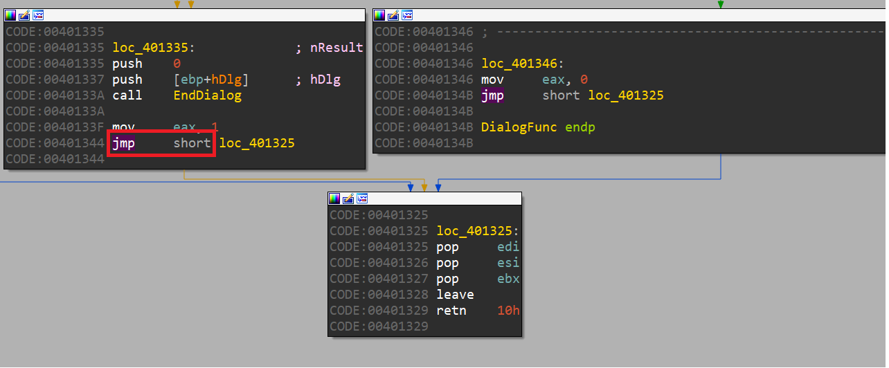

    `jmp short` là một lệnh nhảy ngắn gồm có 2 bytes, có khả năng nhảy về phía trước và ngược lại. Hướng nhảy được chỉ định bởi giá trị của byte thứ hai vì byte đầu tiên là opcode (`0xEB`) của lệnh. Lệnh này không thể nhảy quá xa.

    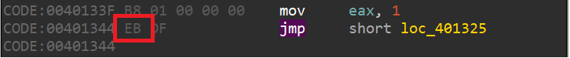

    Nếu thiết lập tùy chọn trong IDA để hiển thị opcode của các lệnh, chúng ta sẽ thấy opcode `EB` tương ứng với lệnh `JMP` và lệnh này sẽ nhảy `5` bước về phía trước kể từ vị trí kết thúc lệnh. Nghĩa là địa chỉ đích của lệnh được tính như sau:

    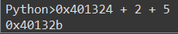

    Lấy địa chỉ bắt đầu của lệnh cộng với `2` là số bytes chiếm bởi lệnh (jmp short) và sau đó cộng thêm `5` (byte thứ hai – bước nhảy). Rõ ràng, việc nhảy tới hoặc lùi với một byte duy nhất không cho chúng ta đạt được bước nhảy xa. **Bước nhảy cao nhất** sẽ là `0x7f`, chúng ta sẽ lấy một ví dụ bên dưới.

    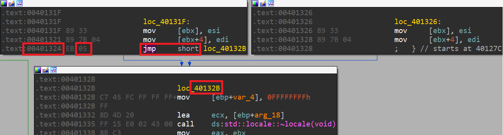

- **Bên lề:** Khi chúng ta thực hiện một số thay đổi sẽ phá vỡ cấu trúc của hàm, để thuận tiện ta nên tiến hành **tạo một bản chụp** (`snapshot`) cơ sở dữ liệu nhằm giúp ta **quay trở lại trạng thái trước khi thay đổi**. Hãy làm việc này vào bất cứ lúc nào bạn nghi ngờ về việc thay đổi sẽ có thể làm phá vỡ cấu trúc hàm và không biết cách nào để khôi phục lại (File -> Take database snapshot hoặc `Ctrl + Shift + W`).

    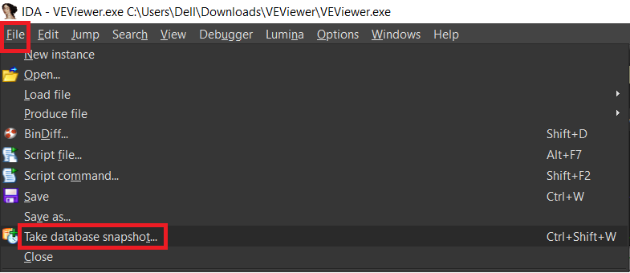

    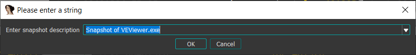

    `IDA` sẽ yêu cầu chúng ta đặt tên cho database được snapshot. Có thể quản lý snapshot này thông qua View -> Database Snapshot Manager (hoặc `Ctrl + Shift + T`).

    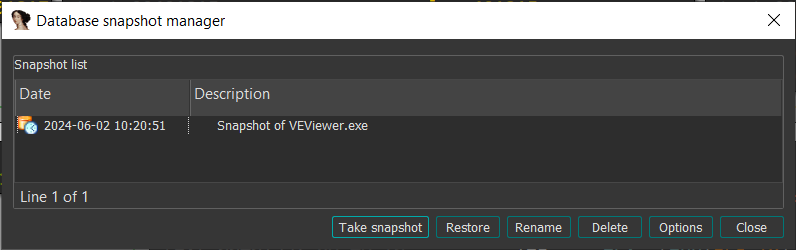

    Tại đây, chúng ta có thể xem danh sách tất cả các snapshot và ngày chụp, cùng với nút `Restore` cho phép chúng ta có thể trở về trạng thái chúng ta muốn từ những bản snapshot mà chúng ta đã lưu.

- Quay lại ví dụ trên, điều gì xảy ra khi tui thay `5` thành `0x7f`:

    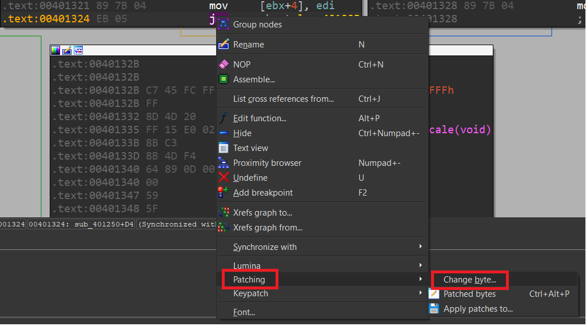

    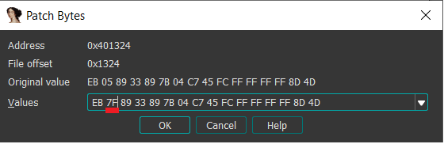

    Sử dụng tính năng `Patch Bytes` của IDA để thực hiện thay đổi lệnh như trên hình. Sau khi patch xong, ta thấy bước nhảy sẽ dài hơn và vượt ra ngoài hàm. Nhấn phím `space bar` để thoát khỏi chế độ đồ hoạ, chuyển sang chế độ `Text`:

    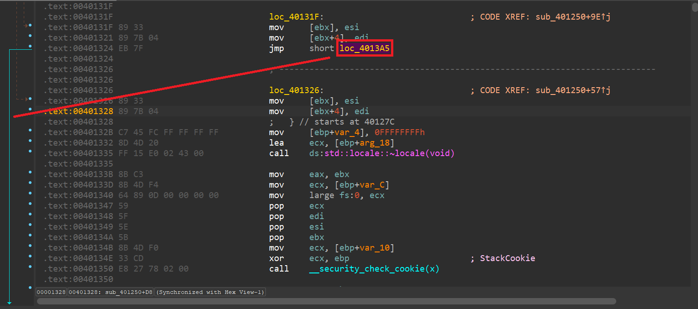

    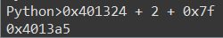

- Chúng ta thấy rằng lệnh nhảy của chúng ta vẫn OK và nhảy tới địa chỉ là `0x4013a5`. Tiếp theo, nếu tôi thay `0x7f` bằng `0x80` thì sẽ thế nào? Quay về chế độ đồ họa và thực hiện thay đổi thành `0x80`. Sau đó lại chuyển về chế độ text, ta có kết quả như hình:

    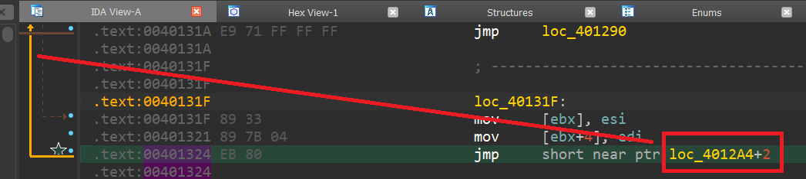

    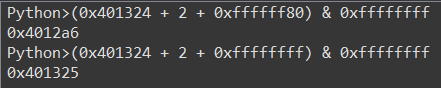

    Trong trường hợp này, do ta thực hiện bước nhảy lùi, để đảm bảo cho công thức tính toán và bởi `Python` không biết được đây là bước nhảy tiến hay nhảy lùi từ giá trị này, ta phải sử dụng giá trị `-0x80` (được biểu diễn bằng một dword ở hệ thập lục phân là `0xFFFFFF80`) và sau đó thực hiện `AND` kết quả tính toán được với `0xFFFFFFFF` nhằm xóa toàn bộ các bit lớn hơn một số 32 bit. Kết quả ta có được địa chỉ nhảy đến là `0x4012a6`.

    Nếu tôi sử dụng giá trị `0xFF` thì ta sẽ có một bước nhảy tối thiểu vì giá trị hex `0xFF` là biểu diễn của `-1`. Ở đây, tôi thay bằng `0xFFFFFFff`. Luôn nhớ rằng ta cần cộng thêm 2 bytes (đó là độ lớn của lệnh), do đó, kết quả tính toán sẽ có được địa chỉ cần nhảy tới là `0x401325`.

    Nếu chúng ta tiếp tục với một giá trị khác, ví dụ `0xFE`, tức là nhảy ngược `-2`, vậy theo công thức sẽ cộng thêm `0xFFFFFFFE`.

    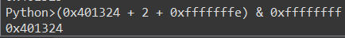

    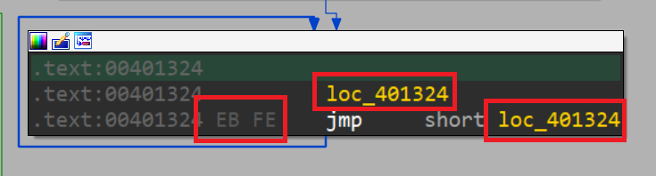

    Với giá trị này thì lệnh nhảy sẽ nhảy tới chính câu lệnh đó hay còn được gọi là `Infinite Loop`, bởi vì nó luôn luôn lặp đi lặp lại chính nó và không thể thoát được.

    **Bên lề:** 2 bytes `0xEB` `0xFE` được gọi là 2 bytes **thần thánh**. Chúng được sử dụng trong quá trình **Unpacking, Debug Malware**. Thông thường **malware** sẽ tạo ra các **thread** hoặc bằng các kĩ thuật **Process Hollowing/ RunPE** để thực thi **malicious code**, lúc này ta sẽ tìm cách **patch bytes** tại **entry point** thành `0xEB 0xFE` để tạo **infinite loop** (lưu ý nhớ lại byte gốc của` EP`), sau khi **patch** xong để **process** thực thi bình thường và rơi vào vòng lặp vô tận, tiến hành **attach** tiến trình mới vào một trình debugger khác để debug tiếp.

    Cứ như vậy, nhảy `-3` sẽ là `0xFD`, vì vậy nó sẽ nhảy đến địa chỉ 0x401323.

    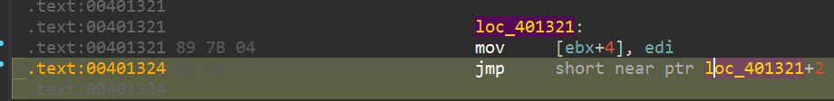

- Rõ ràng với những bước nhảy ngắn, chúng ta không thể nhảy tới bất kỳ địa chỉ nào vì bị giới hạn ở một vài byte xung quanh nơi chúng ta đang sử dụng nó, do đó ta cần sử dụng bước nhảy dài.

    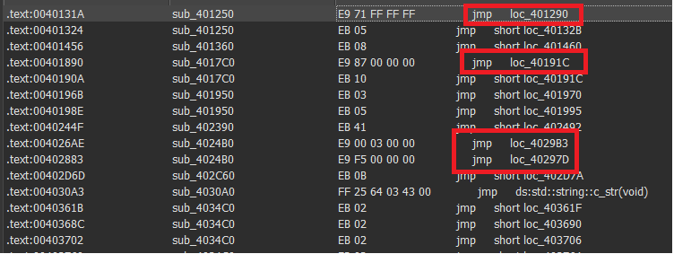

    Như trên hình, ta thấy một vài lệnh nhảy dài. Tiền tố `loc_` đứng đằng trước hàm ý rằng đó là địa chỉ cần nhảy tới:

    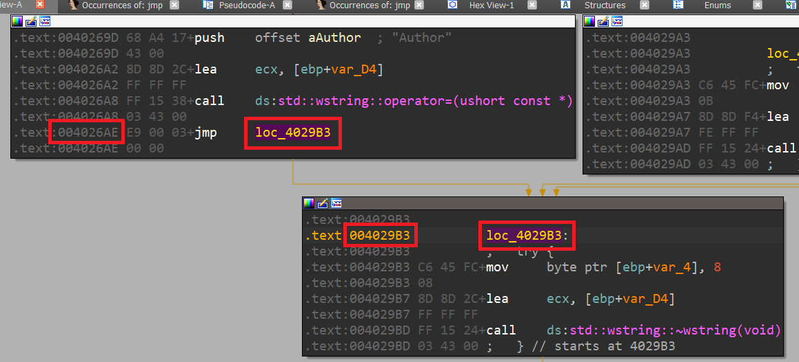

    Trong hình, ta thấy một lệnh nhảy dài, khoảng cách giữa `0x4026ae` và `0x4029b3` là lớn hơn nhiều so với những gì chúng ta có thể đạt được với một bước nhảy ngắn.

    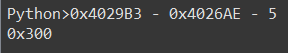

    Khoảng cách sẽ được tính bằng công thức lấy địa chỉ cuối cùng – địa chỉ ban đầu – 5 (là chiều dài của lệnh) (`Final address – start address – 5`), kết quả có được là `0x300`. Đó chính là `dword` đứng cạnh `opcode` của bước nhảy dài `0xe9`.

    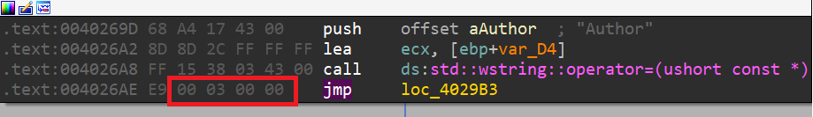

- Nếu tôi sử dụng plugin Keypatch để thay đổi địa chỉ đích của lệnh nhảy đến một hướng ngược lại, ví dụ `0x400000`:

    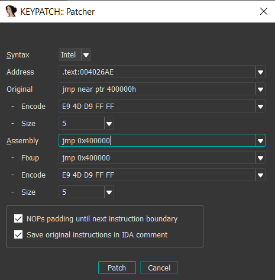

    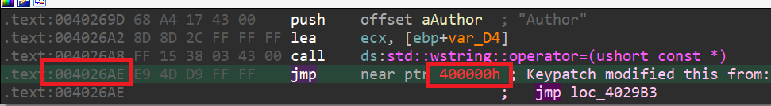

    Tuy nhiên, nó được đánh dấu **màu đỏ** bởi đó không phải là một địa chỉ hợp lệ. Thử áp dụng công thức tính toán trong Python:

    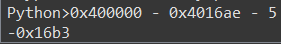

    Kết quả có được là `-0x26b3`:

    Chuyển sang hexa là `FFFFD94D`, đó là các bytes đứng cạnh opcode `0xe9`, được bố trí theo kiểu Little-endian:

    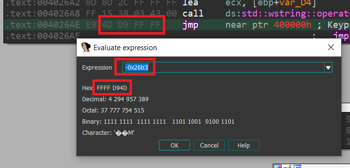

## Lệnh nhảy có điều kiện (JCC)

- Thông thường, các chương trình phải đưa ra các quyết định rẽ nhánh thực thi chương trình, điều này sẽ căn cứ vào việc so sánh các giá trị để chuyển hướng thực hiện chương trình sang một điểm khác.

- Ta có lệnh so sánh:

    `cmp A, B`.

    So sánh toán hạng thứ nhất với toán hạng thứ hai và bật các cờ trên thanh ghi `EFLAGS` dựa theo kết quả tính toán (việc tính toán tương tự như lệnh `SUB`, nhưng khác ở chỗ kết quả tính toán không được lưu lại).

    Tôi cần chương trình thực hiện so sánh giữa `A` và `B`. Dựa vào mối quan hệ giữa chúng, chương trình sẽ thực hiện một công việc nào đó nếu thỏa mãn, còn không chương trình sẽ thực hiện một công việc khác. Vì vậy, bình thường sau khi so sánh sẽ làm thay đổi các `FLAGS`, căn cứ vào trạng thái của cờ, lệnh nhảy có điều kiện sẽ quyết định có thực hiện hay không.

- Ví dụ:

    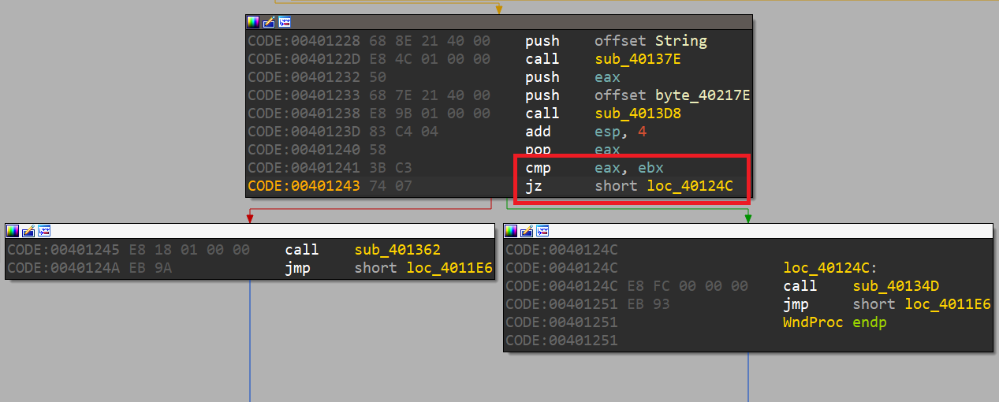

    Trong hình trên, chúng ta thấy một ví dụ về lệnh nhảy có điều kiện là `JZ`. Lệnh này sẽ thực hiện nếu cờ `ZF` được bật. Điều này được quyết định bởi lệnh `CMP` trước đó. Khi hai thanh ghi `EAX` và `EBX` bằng nhau, `CMP` thực hiện phép trừ hai thanh ghi, kết quả sẽ bằng `0` và do đó cờ `ZF` được bật thành `1`. Khi cờ `ZF` được kích hoạt thì sẽ thực hiện lệnh nhảy theo hướng mũi tên màu xanh lá cây, còn nếu hai thanh ghi khác nhau thì sẽ đi theo hướng của mũi tên đỏ.

- Nếu sử dụng debugger để debug chương trình, chúng ta có thể tương tác để thay đổi kết quả trên các cờ. Tuy nhiên, điều quan trọng bây giờ cần phải nhớ có những lệnh nhảy khác nhau có thể xuất hiện trong một chương trình như hình minh họa dưới đây:

    |Hexadecimal|ASM|Meaning|
    |--|--|--|
    |`75` or `0F85`|`JNE`|Jumps if not equal|
    |`74` or `0F84`|`JE`|Jumps if equal|
    |`EB`|`JMP`|Jumps always|
    |`90`|`NOP`|No Operation (It does nothing just filling)|
    |`77` or `OF87`|`JA`|Jumps if above|
    |`0F86`|`JNA`|Jmps if not above|
    |`0F83`|`JAE`|Jumps if above or equal|
    |`0F82`|`JNAE`|Jumps if not above or equal|
    |`0F82`|`JB`|Jumps if below|
    |`0F83`|`JNB`|Jumps if not below|
    |`0F86`|`JBE`|Jumps if below or equal|
    |`0F87`|`JNBE`|Jumps if not below or equal|
    |`0F8F`|`JG`|Jumps if greater|
    |`0F8E`|`JNB`|Jumps if not greater|
    |`0F8D`|`JGE`|Jumps if greater or equal|
    |`0F8C`|`JNGE`|Jumps if not greater or equal|
    |`0F8C`|`JL`|Jumps if less|
    |`0F8D`|`JNL`|Jumps if not less|
    |`0F8E`|`JLE`|Jumps if less or equal|
    |`0F8F`|`JNLE`|Jumps if not less or equal|

- Ngoại trừ các lệnh `JMP` và `NOP` được liệt kê trong bảng, các lệnh còn lại đều là các lệnh **nhảy có điều kiện**. Các lệnh nhảy này đều căn cứ vào kết quả của câu lệnh so sánh trước đó.

    - Các lệnh nhảy `Above` / `Below` được sử dụng cho so sánh số không dấu (**unsinged comparison**).

    - Các lệnh nhảy `Greater than` / `Less than` được sử dụng cho so sánh số có dấu (**singed comparison**).

        |Instruction|Useful to...|
        |--|--|
        |`jmp`|Always jump|
        |`ja`|Unsigned >|
        |`jae`|Unsigned >=|
        |`jb`|Unsiged <|
        |`jbe`|Unsiged <=|
        |`j`c|Unsiged overflow, or multiprecision add|
        |`jecxz`|Compare ecx with 0|
        |`je`|Equality|
        |`jg`|Signed >|
        |`jge`|Signed >=|
        |`jl`|Signed <|
        |`jle`|Signed <=|
        |`jne`|Inequality|
        |`jo`|Signed overflow|

    - Mặc dù có nhiều lệnh nhảy có điều kiện nhưng may mắn là trong số đó có các lệnh cùng một mục đích. Ví dụ: **JNE == JNZ** (Nhảy nếu không bằng nhau, Nhảy nếu không bằng 0, cả hai cùng kiểm tra cờ (**ZF == 0**)).

        |Instruction|Description|Aliases|Flags|
        |--|--|--|--|
        |`jz`|Jump if zero|`je`|`zf` = 1|
        |`jnz`|Jump if not zero|`jne`|`zf` = 0|
        |`jl`|Jump if less|`jnge`|`sf` = 1|
        |`jle`|jump if less or equal|`jng`|`zf` = 1 or `sf` = 1|
        |`jg`|jump if greater|`jnle`|`zf` = 0 and `sf` = 0|
        |`jge`|jump if greater or equal|`jnl`|`sf` = 0|
        |`jc`|jump if carry|`jb`, `jnae`|`cf` = 1|
        |`jnc`|jump if not carry|`jnb`, `jae`|`cf` = 0|

    - **Bên lề:** bên cạnh việc so sánh sử dụng câu lệnh `CMP`, một câu lệnh khác cũng rất hay được sử dụng là `TEST`. Bản chất của lệnh `TEST` là tính toán logic thông qua việc `AND` hai toán hạng, căn cứ trên kết quả để bật cờ. Kết quả tính toán sẽ không được lưu lại.

        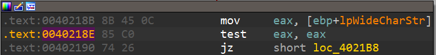

## `CALL` và `RET`

- Các lệnh tiếp theo mà tôi sẽ đề cập đến là lệnh `CALL` (dùng để gọi một hàm) và lệnh `RET` (dùng để trở quay trở về lệnh tiếp theo) sẽ được thực hiện sau lệnh `Call`.

- Xem hình sau:

    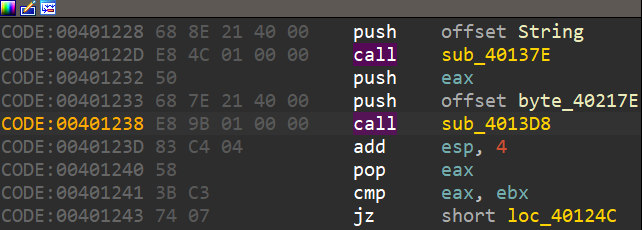

    Trên hình, chúng ta thấy một ví dụ của lệnh `CALL`, lệnh này sẽ nhảy đến địa chỉ `0x4013d8` để thực hiện hàm tại đó (chúng ta thấy tiền tố `sub_` ở phía trước của địa chỉ `0x4013D8` thông báo cho ta biết đây là một hàm).

- Lệnh `CALL` thực hiện sẽ lưu vào **đỉnh** của ngăn xếp (Stack) **địa chỉ trở về** sau khi thực hiện xong hàm (tức là địa chỉ bên dưới của lệnh `Call` mà trong trường hợp này là `0x40123d`). Sau đó, nó sẽ thay đổi địa chỉ của thanh ghi `EIP` bằng địa chỉ đã chỉ định trong câu lệnh. Địa chỉ đích có thể được chỉ định theo nhiều cách:

    - Giá trị trực tiếp (**immediate value**): `call 0x401da8`.

    - Thanh ghi dùng chung: `call eax`.

    - Vị trí bộ nhớ: `call word ptr [0x40202c]`.

- Ta có thể truy cập các lệnh bên trong `CALL` bằng cách nhấn `Enter` tại lệnh `CALL` đó:

    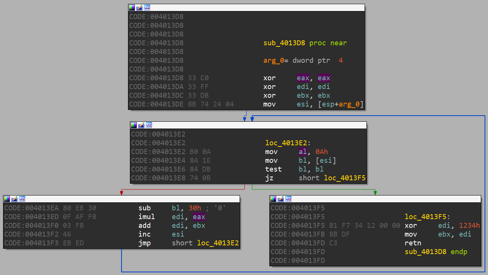

- Khi kết thúc hàm, sẽ thực hiện một lệnh `RET`, lệnh này có nhiệm vụ **lấy địa chỉ trở về** được lưu tại đỉnh của stack là `0x40123d`, đưa vào thanh ghi `EIP` và nhảy tới địa chỉ này để tiếp tục thực hiện lệnh sau `CALL`.

    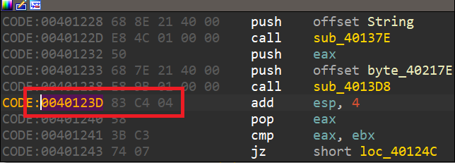

- Bên lề: liên quan đến hai lệnh `Call & Ret` chúng ta cần biết thêm về tập quán gọi hàm (hay từ chuyên môn là **calling convention**), bởi vì việc gọi hàm có thể khác nhau trong mã lệnh asm. Nó bao gồm thứ tự các tham số được đẩy vào ngăn xếp hay các thanh ghi, hàm gọi (**caller**) hay hàm được gọi (**callee**) chịu trách nhiệm **dọn dẹp ngăn xếp khi hoàn tất hàm**. Tùy thuộc vào trình biên dịch, có hai tập quán gọi hàm hay gặp nhất là `cdecl` (**C declaration**) và và **stdcall**.

- `cdecl` – tập quán gọi hàm phổ biến nhất:

    - Tham số của hàm được đẩy vào stack theo chiều từ phải qua trái.

    - Kết quả trả về của hàm thường lưu vào thanh ghi EAX.

    - Hàm gọi (caller) chịu trách nhiệm dọn dẹp stack.

    **Ví dụ:**

    `_cdecl int function(int arg1, int arg2, int arg3)`

    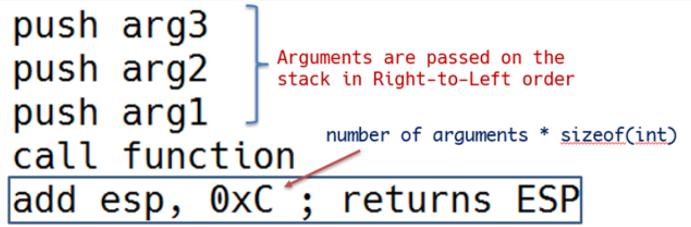

- `Stdcall` – thường được sử dụng bởi **Microsoft C++**, đặc biệt là **Win32 API functions**:

    - Tham số của hàm được đẩy vào stack theo chiều từ phải qua trái.

    - Kết quả trả về của hàm thường lưu vào thanh ghi `EAX`.

    - Hàm được gọi (callee) chịu trách nhiệm dọn dẹp stack.

    **Ví dụ:**

    `_stdcall int function(int a, int b, int c)`

    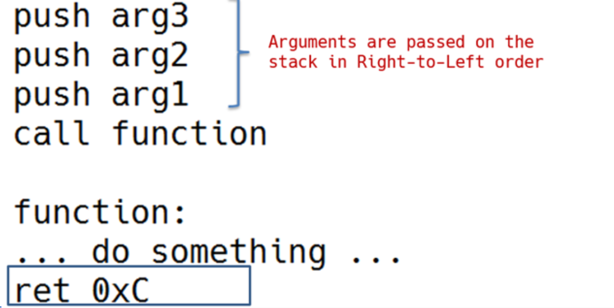

# [BÀI 8: PHÂN TÍCH CRACKME CRUEHEAD](https://kienmanowar.wordpress.com/2019/03/15/reversing-with-ida-from-scratch-p8/#more-3668)

# [BÀI 9: PHÂN TÍCH FILE CRACKME](https://kienmanowar.wordpress.com/2019/03/22/reversing-with-ida-from-scratch-p9/#more-3729)

# [BÀI 10: PHÂN TÍCH CRACKME](https://kienmanowar.wordpress.com/2019/03/29/reversing-with-ida-from-scratch-p10/#more-3773)

- `Ctrl + Alt + B`: xem list break_point.

# [BÀI 11: KIẾN THỨC VỀ FLAG](https://kienmanowar.wordpress.com/2019/04/18/reversing-with-ida-from-scratch-p11/#more-3831)

# [BÀI 12: THỰC HÀNH TEST_REVERSER.EXE](https://kienmanowar.wordpress.com/2019/04/27/reversing-with-ida-from-scratch-p12/#more-3863)

- [FILE](_FILE\TEST_REVERSER.exe).

